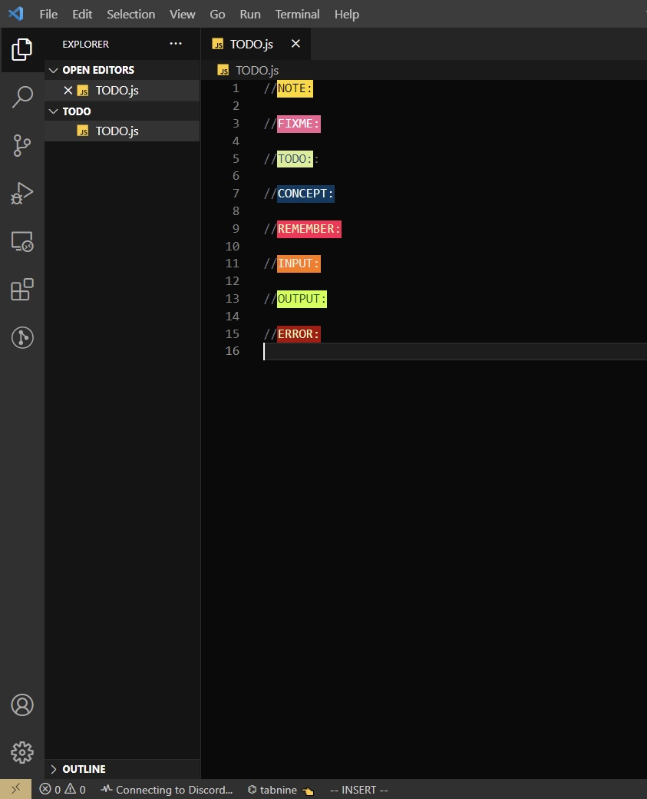
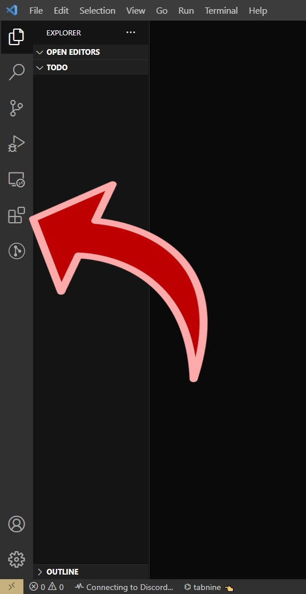
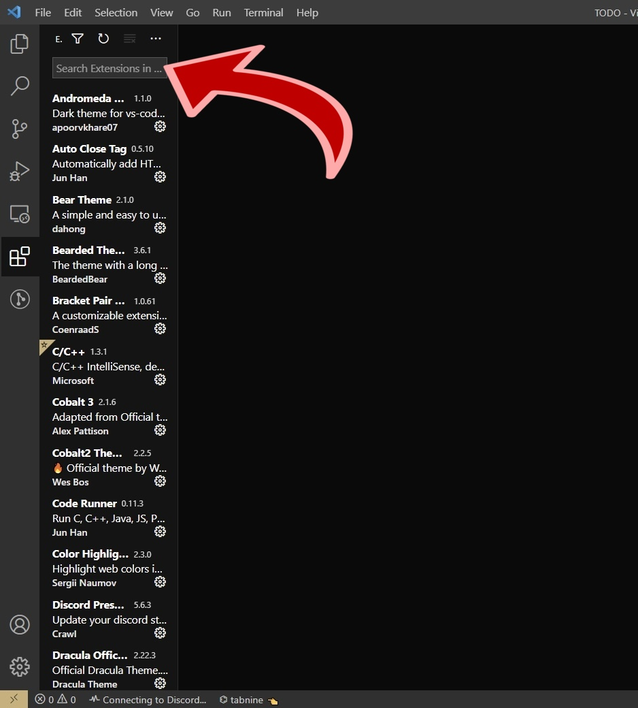
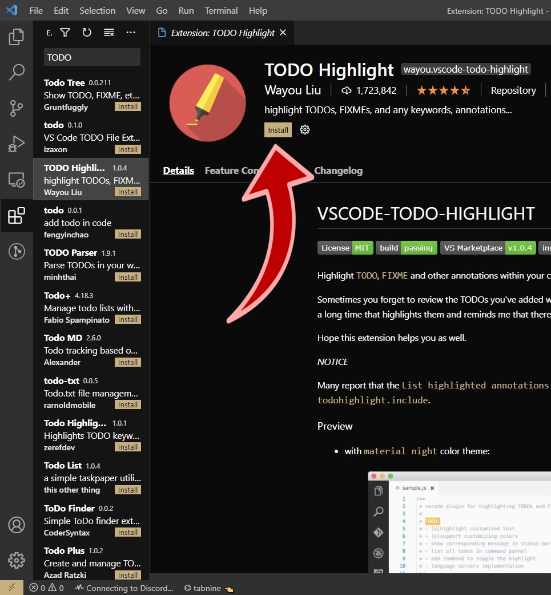
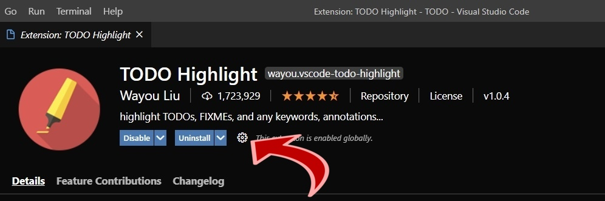
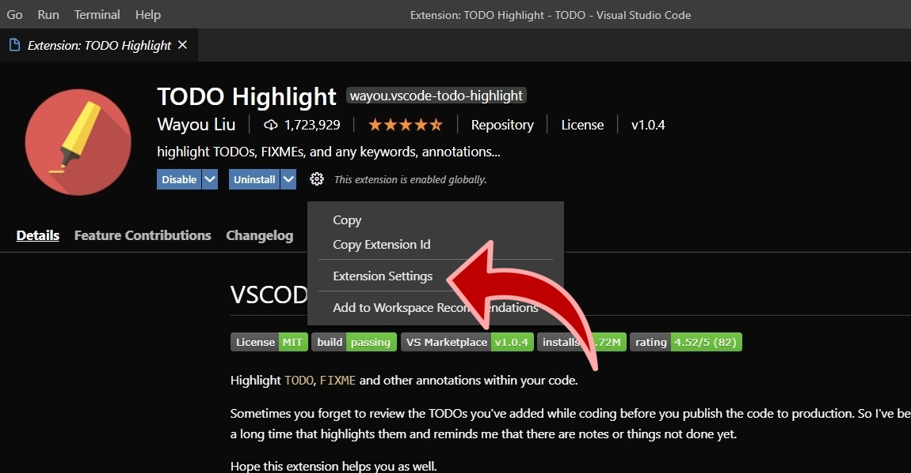
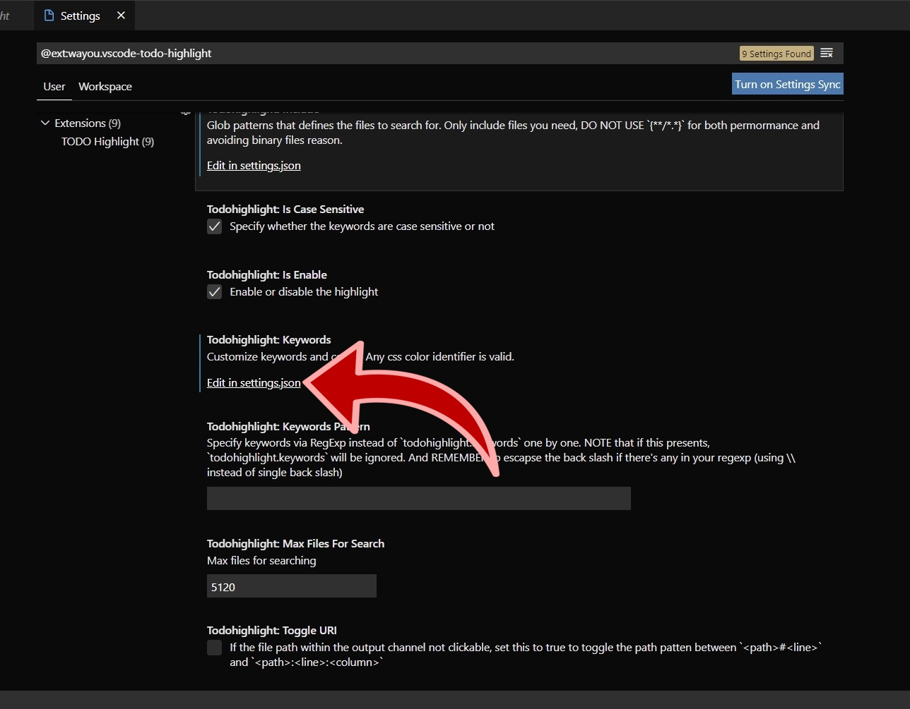
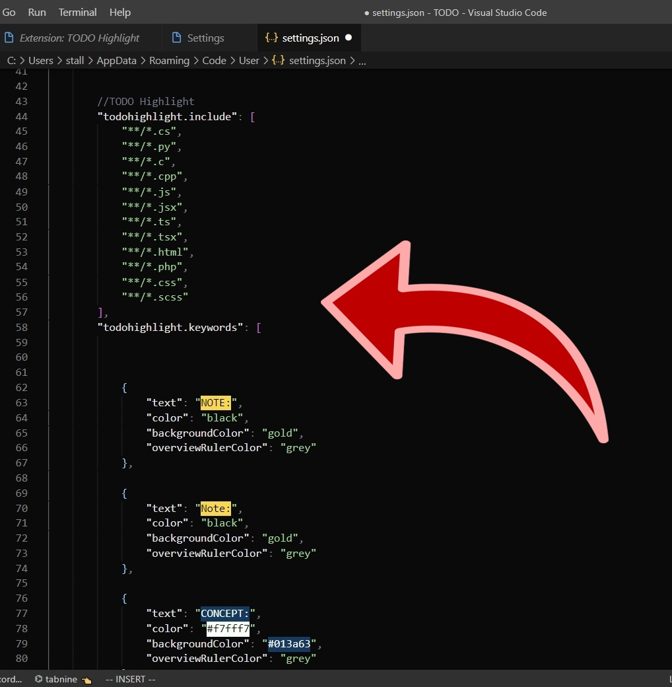

# TODO-Highlight.Config
A VSCode Extension Configuration File

___

# Overview: :zap:

___

> ## TODO Highlight: :pushpin:
> A Free VSCode Extension , That Highlights Texts And Comments That Are Eye-Catching To The User , Keeping The Code Organised.
> TODO Highlits Provides Defaults Labelling Only To Keywords Such As TODO: FIXME: And NOTE:

+ I Have Shared My Personal TODO Highlight Configuration That Highlights Text Such As: 

+ You Can Have Complete Customizability And Change Keywords As Well As Colors As Per Your Wishes And Requirements.

___

# Getting Started: :bulb:

___

## Pre-Requisites: :scissors:
1. [VSCode](https://code.visualstudio.com/download) Installed And Running. :relaxed:
2. Creativity (Just Kidding) :sweat_smile:

## 1. Open Extensions: :exclamation:
Click On The Extensions Tab In VSCode Navigation Bar

## 2. Search: TODO Highlight ~Wayou Liu :mag:

## 3. Click Install: :rocket:
Click Install Inorder To Add Extension To Your VSCode.

## 4. Click On Extension Settings: :wrench:
Click On The Gear Icon Next To Uninstall Button As Shown Below:

## 5. Navigate Down: :file_folder:
Navigate Down To Where It Says TODO Highlight: Keywords And Click On Edit In Settings.JSON As Shown In The Image Down Below.

## 6. Custom Code (This Repository): :paperclip:
Copy The Code From [This Repository](https://github.com/StallonesHyper/TODO-Highlight.Config.git) Or Simply Navigate Above To File Named Settings.JSON

# NOTE: :lock:
>Copy The Code Inside The { Curly Braces } Since It Is A JSON File.

## 7. Change Keywords: :pencil2:
Change Keywords And Colours Based On Your Preferences...And Have Fun :wink:

___
